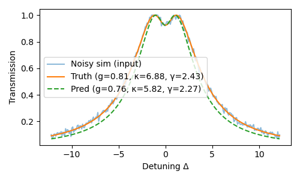

# Cavity QED Parameter Inference with Neural Networks

## Introduction

Cavity quantum electrodynamics (QED) studies the interaction between quantized emitters, such as atoms, quantum dots, or superconducting qubits—and the quantized electromagnetic modes of a high-finesse optical or microwave resonator.  

In the simplest *“one-atom, one-cavity”* scenario, the steady-state transmission spectrum of a weak probe beam carries direct signatures of three fundamental rates:  
- the atom–cavity coupling strength $g$,  
- the total cavity energy decay rate $\kappa$, and  
- the atomic spontaneous emission rate $\gamma$.  

Precise knowledge of these parameters underpins applications in quantum information processing, nonclassical light generation, and precision metrology.

## Input–Output Theory

Traditionally, extracting $(g, \kappa, \gamma)$ from an experimentally measured transmission curve requires nonlinear least-squares fitting of the analytic input–output formula:

$$
T(\Delta) \;=\; 
\left| \; 
\frac{\kappa_{\text{ext}}}
     {\,i\Delta + \tfrac{\kappa}{2} + \dfrac{g^{2}}{\,i\Delta + \tfrac{\gamma}{2}}}
\;\right|^{2},
$$

where $\Delta$ is the detuning from resonance and $\kappa_{\text{ext}}$ the external coupling rate.  

While this approach is exact in the low-saturation limit, it can be computationally intensive and sensitive to measurement noise, making real-time parameter inference challenging in dynamic or high-throughput experiments.
